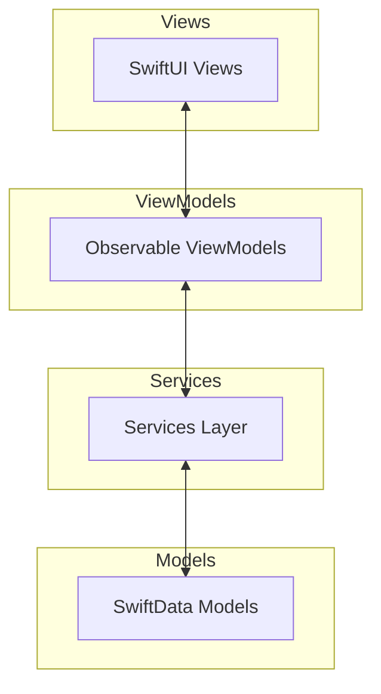
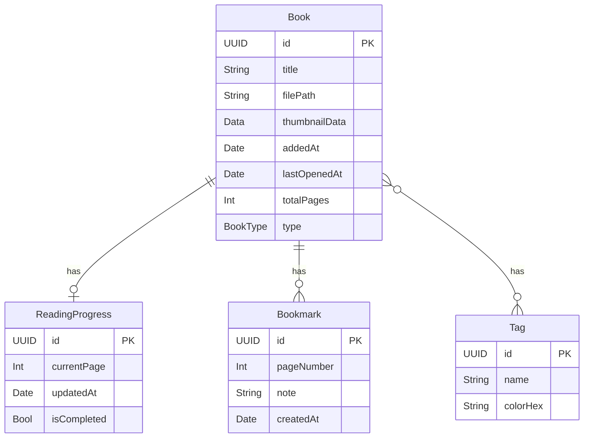

# MangaViewer

macOS向けSwiftUI製漫画ビューワーアプリケーション。

## 概要

- **対応OS**: macOS 14 (Sonoma) 以降
- **フレームワーク**: SwiftUI, SwiftData
- **アーキテクチャ**: Modern MVVM with @Observable

## 機能

### 対応フォーマット

- CBZ / ZIP
- CBR / RAR
- 画像フォルダ（jpg, png, gif, webp）

### リーダー機能

- 単ページ / 見開き表示切替
- 読み方向切替（左→右 / 右→左）
- ズームモード（ページフィット / 幅フィット / 高さフィット / 原寸 / 自由ズーム）
- キーボードナビゲーション
- 全画面モード
- しおり機能
- 画像フィルタ（明るさ / コントラスト / セピア / グレースケール）

### ライブラリ機能

- フォルダ監視による自動検知
- サムネイル一覧表示
- 既読管理
- タグ付け
- 検索・ソート

## アーキテクチャ



## ディレクトリ構成

```shell
MangaViewer/
├── MangaViewerApp.swift
├── Info.plist
├── Assets.xcassets/
│
├── Models/
│   ├── Book.swift
│   ├── ReadingProgress.swift
│   ├── Bookmark.swift
│   └── Tag.swift
│
├── Services/
│   ├── ArchiveService.swift
│   ├── ZipExtractor.swift
│   ├── RarExtractor.swift
│   ├── FolderLoader.swift
│   ├── ImageCache.swift
│   ├── LibraryWatcher.swift
│   └── ThumbnailGenerator.swift
│
├── ViewModels/
│   ├── LibraryViewModel.swift
│   ├── ReaderViewModel.swift
│   └── SettingsViewModel.swift
│
├── Views/
│   ├── MainWindow.swift
│   ├── Library/
│   │   ├── LibraryView.swift
│   │   ├── BookGridItem.swift
│   │   └── TagSidebar.swift
│   ├── Reader/
│   │   ├── ReaderView.swift
│   │   ├── PageView.swift
│   │   ├── SpreadView.swift
│   │   ├── ZoomableImageView.swift
│   │   └── ReaderToolbar.swift
│   └── Settings/
│       └── SettingsView.swift
│
├── Utilities/
│   ├── KeyboardHandler.swift
│   ├── ImageFilter.swift
│   └── Constants.swift
│
└── Resources/
    └── Localizable.strings
```

## データモデル



## 開発コマンド

### ビルド

```bash
# デバッグビルド
swift build

# リリースビルド
swift build -c release

# macOS アプリバンドル (.app) を作成
./scripts/build-app.sh
```

### 実行

```bash
# デバッグ実行
swift run

# リリースビルドを実行
swift run -c release

# アプリバンドルを起動
open .build/release/MangaViewer.app

# Applicationsにインストール
cp -R .build/release/MangaViewer.app /Applications/
```

### テスト

```bash
# 全テスト実行
swift test

# 特定のテストスイートを実行
swift test --filter ImageFileFilterTests

# 詳細出力
swift test --verbose
```

### Linter (SwiftLint)

```bash
# Lintチェック（警告・エラー表示）
swiftlint lint

# 静かに実行（エラーのみ表示）
swiftlint lint --quiet

# 自動修正可能な問題を修正
swiftlint lint --fix
```

### Formatter

```bash
# SwiftLintで自動修正
swiftlint lint --fix

# SwiftFormatを使用する場合（要インストール: brew install swiftformat）
swiftformat .

# ドライラン（変更を表示するのみ）
swiftformat . --dryrun
```

### クリーン

```bash
# ビルドキャッシュをクリア
swift package clean

# 完全クリーン（.buildディレクトリ削除）
rm -rf .build
```

### 依存関係

```bash
# 依存関係を更新
swift package update

# 依存関係を解決
swift package resolve

# 依存関係を表示
swift package show-dependencies
```

## アプリバンドル (.app)

### バンドル構造

```shell
MangaViewer.app/
└── Contents/
    ├── Info.plist          # アプリ設定・ファイル関連付け
    ├── PkgInfo             # パッケージタイプ識別子
    ├── MacOS/
    │   └── MangaViewer     # 実行ファイル
    └── Resources/
        └── ZIPFoundation_ZIPFoundation.bundle/
```

### 使用方法

| 操作 | コマンド |
| ---- | ------- |
| アプリをビルド | `./scripts/build-app.sh` |
| アプリを起動 | `open .build/release/MangaViewer.app` |
| Applicationsにインストール | `cp -R .build/release/MangaViewer.app /Applications/` |

### Info.plistの機能

- **ファイル関連付け**: `.cbz`, `.zip`, `.cbr`, `.rar` をダブルクリックで開ける
- **macOS 14+対応**: `LSMinimumSystemVersion`
- **Retina対応**: `NSHighResolutionCapable`

## 依存ライブラリ

| ライブラリ | 用途 | リポジトリ |
| --------- | ---- | --------- |
| ZIPFoundation | ZIP/CBZ展開 | <https://github.com/weichsel/ZIPFoundation> |

### RAR/CBR対応について

RAR/CBRファイルの展開には、以下のいずれかのコマンドラインツールが必要です：

```bash
# 推奨: unar (The Unarchiver)
brew install unar

# 代替: 7-Zip
brew install p7zip

# 代替: unrar
brew install unrar
```

## キーボードショートカット

| キー | 動作 |
| ---- | ---- |
| `←` / `→` | 前/次ページ（読み方向対応） |
| `Space` | 次ページ |
| `Shift+Space` | 前ページ |
| `F` | 全画面切替 |
| `1` | 単ページモード |
| `2` | 見開きモード |
| `+` / `-` | ズームイン/アウト |
| `0` | フィットモードに戻す |
| `B` | ブックマーク追加 |

## 設定項目

### 読書設定

- デフォルト読み方向（左→右 / 右→左）
- デフォルト表示モード（単ページ / 見開き）
- デフォルトズームモード

### ライブラリ設定

- 監視フォルダ一覧
- サムネイルサイズ

### 表示設定

- ダークモード（システム追従 / 常にライト / 常にダーク）

## 画像キャッシュ戦略

- **実装**: NSCache
- **最大容量**: 50枚 or 500MB
- **先読み**: 現在ページの前後3ページ
- **優先度**: 現在ページ > 次ページ > 前ページ > ...

## 画像フィルタ

| フィルタ | Core Imageフィルタ | 範囲 |
| -------- | ----------------- | ---- |
| Brightness | CIColorControls | -1.0 ~ 1.0 |
| Contrast | CIColorControls | 0.5 ~ 2.0 |
| Sepia | CISepiaTone | 0.0 ~ 1.0 |
| Grayscale | CIPhotoEffectMono | - |

## ライセンス

MIT License
