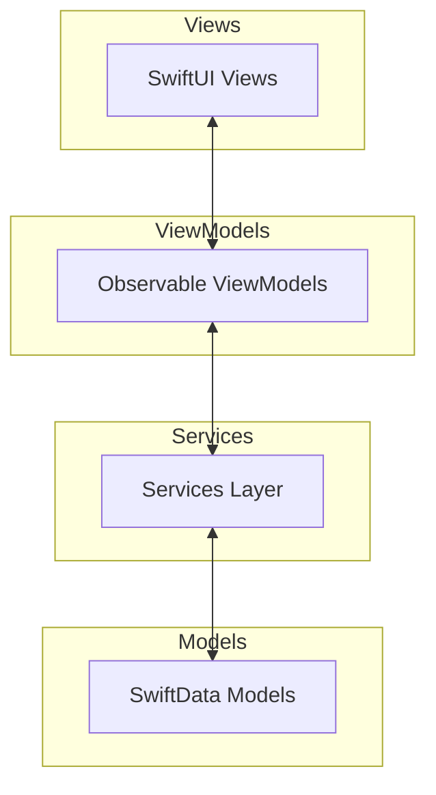
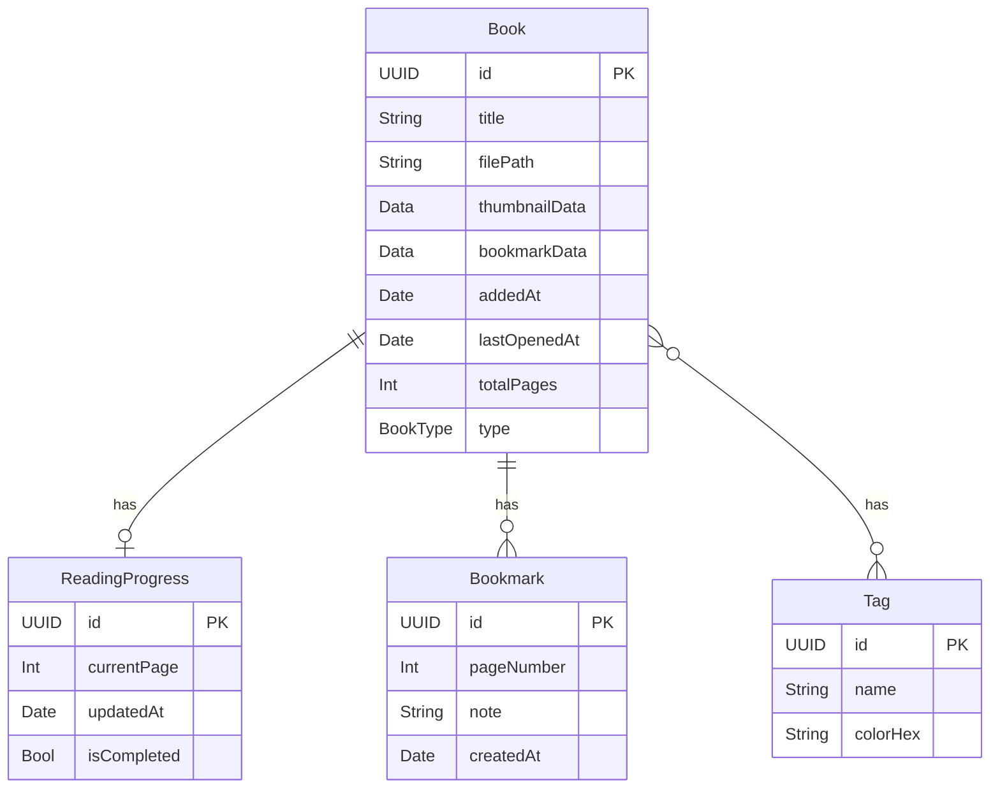

# MangaViewer

macOS向けSwiftUI製漫画ビューワーアプリケーション。Mac App Store対応。

## 概要

- **対応OS**: macOS 14 (Sonoma) 以降
- **フレームワーク**: SwiftUI, SwiftData
- **アーキテクチャ**: Modern MVVM with @Observable
- **Swift**: 6.0（Strict Concurrency有効）
- **App Sandbox**: 対応済み（セキュリティスコープブックマークによるファイルアクセス永続化）
- **バンドルID**: `work.okamyuji.mangaviewer`

## 機能

### 対応フォーマット

- CBZ / ZIP
- CBR / RAR
- 画像フォルダ（jpg, png, gif, webp）

### リーダー機能

- 単ページ / 見開き表示切替
- 読み方向切替（左→右 / 右→左）
- ズームモード（ページフィット / 幅フィット / 高さフィット / 原寸 / 自由ズーム）
- キーボードナビゲーション
- 全画面モード
- しおり機能
- 画像フィルタ（明るさ / コントラスト / セピア / グレースケール）

### ライブラリ機能

- フォルダ監視による自動検知（DispatchSource）
- サムネイル一覧表示
- 既読管理
- タグ付け
- 検索・ソート
- Finderからのダブルクリック / ドラッグ＆ドロップ対応

## アーキテクチャ



## ディレクトリ構成

```shell
MangaViewer/
├── Package.swift                    # SPMパッケージ定義
├── project.yml                      # XcodeGen設定
├── Info.plist                       # アプリ情報
├── MangaViewer.entitlements         # App Sandboxエンタイトルメント
├── Local.xcconfig.template          # ビルド設定テンプレート
│
├── Sources/MangaViewer/
│   ├── MangaViewerApp.swift
│   │
│   ├── Models/
│   │   ├── Book.swift
│   │   ├── BookType.swift
│   │   ├── ReadingProgress.swift
│   │   ├── Bookmark.swift
│   │   └── Tag.swift
│   │
│   ├── Services/
│   │   ├── ArchiveService.swift
│   │   ├── ZipExtractor.swift
│   │   ├── RarExtractor.swift
│   │   ├── FolderLoader.swift
│   │   ├── ImageCache.swift
│   │   ├── ImageFileFilter.swift
│   │   ├── LibraryWatcher.swift
│   │   ├── MangaViewerError.swift
│   │   ├── PageProvider.swift
│   │   ├── SecurityScopedBookmarkManager.swift
│   │   └── ThumbnailGenerator.swift
│   │
│   ├── ViewModels/
│   │   ├── LibraryViewModel.swift
│   │   ├── ReaderViewModel.swift
│   │   └── SettingsViewModel.swift
│   │
│   ├── Views/
│   │   ├── ContentView.swift
│   │   ├── Library/
│   │   │   ├── LibraryView.swift
│   │   │   ├── BookGridItem.swift
│   │   │   ├── SidebarView.swift
│   │   │   └── TagSidebar.swift
│   │   ├── Reader/
│   │   │   ├── ReaderView.swift
│   │   │   ├── SpreadView.swift
│   │   │   ├── ZoomableImageView.swift
│   │   │   ├── ReaderToolbar.swift
│   │   │   └── KeyboardHandlerView.swift
│   │   └── Settings/
│   │       └── SettingsView.swift
│   │
│   └── Utilities/
│       ├── Constants.swift
│       ├── ImageFilter.swift
│       ├── ReadingDirection.swift
│       ├── SortOrder.swift
│       └── ZoomMode.swift
│
├── Tests/MangaViewerTests/
│
├── Resources/
│   ├── Assets.xcassets/             # アプリアイコン
│   └── PrivacyInfo.xcprivacy        # プライバシーマニフェスト
│
├── scripts/
│   └── build-app.sh                 # SPMリリースビルド＋.app作成
│
└── fastlane/
    ├── Appfile
    └── Fastfile
```

## データモデル



## セットアップ

### ビルド設定

XcodeGen + Local.xcconfigでチームIDなどの環境依存設定を管理しています。

```bash
# テンプレートからLocal.xcconfigを作成
cp Local.xcconfig.template Local.xcconfig

# DEVELOPMENT_TEAMを自分のチームIDに変更
# Local.xcconfigはgitignoreされています
```

### Xcodeプロジェクト生成

```bash
# XcodeGenでプロジェクトを生成
xcodegen generate

# Xcodeで開く
open MangaViewer.xcodeproj
```

## 開発コマンド

### ビルド

```bash
# デバッグビルド
swift build

# リリースビルド
swift build -c release

# macOS アプリバンドル (.app) を作成
./scripts/build-app.sh
```

### 実行

```bash
# デバッグ実行
swift run

# リリースビルドを実行
swift run -c release

# アプリバンドルを起動
open .build/release/MangaViewer.app

# Applicationsにインストール
cp -R .build/release/MangaViewer.app /Applications/
```

### テスト

```bash
# 全テスト実行
swift test

# 特定のテストスイートを実行
swift test --filter ImageFileFilterTests

# 詳細出力
swift test --verbose
```

### Linter / Formatter

```bash
# SwiftLint: Lintチェック
swiftlint lint --quiet

# SwiftLint: 自動修正
swiftlint lint --fix

# SwiftFormat: フォーマット
swiftformat .

# SwiftFormat: ドライラン（変更を表示するのみ）
swiftformat . --dryrun
```

### Fastlane

```bash
# 依存関係インストール
bundle install

# テスト実行
bundle exec fastlane test

# リリースビルド
bundle exec fastlane build
```

### クリーン

```bash
# ビルドキャッシュをクリア
swift package clean

# 完全クリーン（.buildディレクトリ削除）
rm -rf .build
```

### 依存関係

```bash
# 依存関係を更新
swift package update

# 依存関係を解決
swift package resolve

# 依存関係を表示
swift package show-dependencies
```

## App Sandbox

Mac App Store配布のためApp Sandboxに対応しています。

### エンタイトルメント

| キー | 用途 |
| ---- | ---- |
| `com.apple.security.app-sandbox` | App Sandbox有効化 |
| `com.apple.security.files.user-selected.read-write` | NSOpenPanelで選択したファイルへのアクセス |
| `com.apple.security.files.bookmarks.app-scope` | セキュリティスコープブックマークで再起動後もアクセス維持 |

### セキュリティスコープブックマーク

`SecurityScopedBookmarkManager`（actor）がブックマークの保存・復元・アクセス管理を担当。ユーザーが選択したファイル/フォルダへのアクセスをアプリ再起動後も維持します。

## キーボードショートカット

| キー | 動作 |
| ---- | ---- |
| `←` / `→` | 前/次ページ（読み方向対応） |
| `Space` | 次ページ |
| `Shift+Space` | 前ページ |
| `F` | 全画面切替 |
| `1` | 単ページモード |
| `2` | 見開きモード |
| `+` / `-` | ズームイン/アウト |
| `0` | フィットモードに戻す |
| `B` | ブックマーク追加 |

## 設定項目

### 読書設定

- デフォルト読み方向（左→右 / 右→左）
- デフォルト表示モード（単ページ / 見開き）
- デフォルトズームモード

### ライブラリ設定

- 監視フォルダ一覧
- サムネイルサイズ

### 表示設定

- ダークモード（システム追従 / 常にライト / 常にダーク）

## 画像キャッシュ戦略

- **実装**: NSCache + ImageCacheActor（Swift Concurrency対応）
- **最大容量**: 50枚 or 500MB
- **先読み**: 現在ページの前後3ページ
- **優先度**: 現在ページ > 次ページ > 前ページ > ...
- **世代管理**: ブック切替時にキャッシュを無効化

## 画像フィルタ

| フィルタ | Core Imageフィルタ | 範囲 |
| -------- | ----------------- | ---- |
| Brightness | CIColorControls | -1.0 ~ 1.0 |
| Contrast | CIColorControls | 0.5 ~ 2.0 |
| Sepia | CISepiaTone | 0.0 ~ 1.0 |
| Grayscale | CIPhotoEffectMono | - |

## 依存ライブラリ

| ライブラリ | 用途 | リポジトリ |
| --------- | ---- | --------- |
| ZIPFoundation | ZIP/CBZ展開 | <https://github.com/weichsel/ZIPFoundation> |
| Unrar.swift | RAR/CBR展開 | <https://github.com/mtgto/Unrar.swift> |

## ライセンス

MIT License
